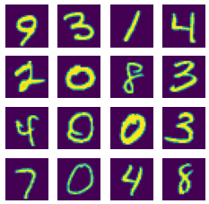
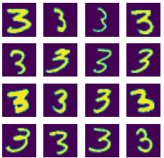
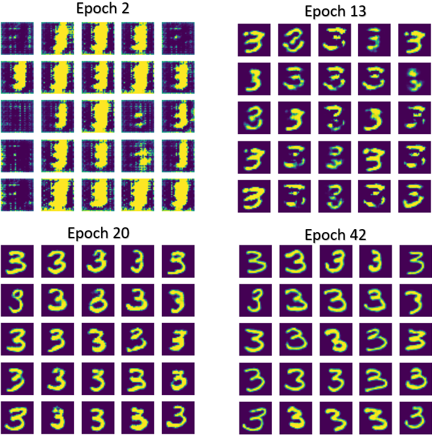
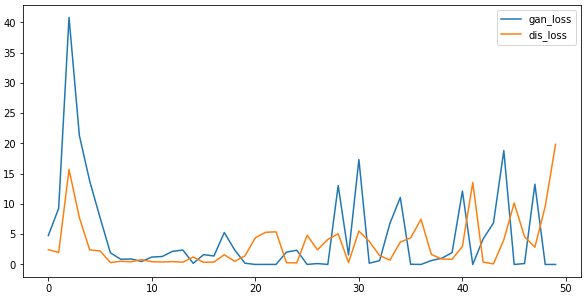
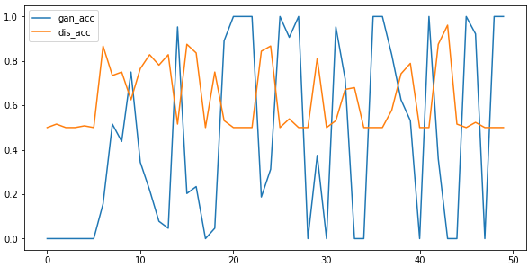
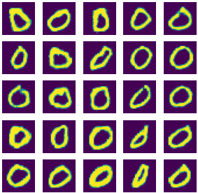
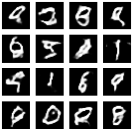
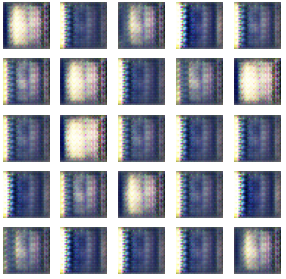

# DeepFake-DCGANs-Python

Deepfake image generation using own and third-party GAN

Notebooks with last DCGAN models are gan_last.ipynb (MNIST) and gan_color.ipynb 
(AVHN). Other files named dcgan* are previous version with another GAN models.

## Agenda

>1. [Introduction](#Introduction)
>2. [Build your own DCGAN:](#Build-your-own-DCGAN)
>>- [import modules](#1-import-modules)
>>- [download dataset](#2-download-dataset)
>>- [generator model](#3-generator-model)
>>- [discriminator model](#4-discriminator-model)
>>- [DCGAN](#5-DCGAN)
>>- [train model](#6-train-model)
>3. [Use other datasets](#Use-other-datasets)
>4. [Third-party GANs](#Third-party-GANs)
___
## Introduction

Deep fake (also spelled deepfake) is a type of artificial intelligence used to 
create convincing images, audio and video hoaxes. The term, which describes both 
the technology and the resulting bogus content, is a portmanteau of deep learning 
and fake.

Deepfake content is created by using two competing AI algorithms -- one is called 
the generator and the other is called the discriminator. The generator, which 
creates the phony multimedia content, asks the discriminator to determine whether 
the content is real or artificial.

Together, the generator and discriminator form something called a generative 
adversarial network (GAN). Each time the discriminator accurately identifies 
content as being fabricated, it provides the generator with valuable information 
about how to improve the next deepfake.

The first step in establishing a GAN is to identify the desired output and create 
a training dataset for the generator. Once the generator begins creating an 
acceptable level of output, it can be fed to the discriminator.

As the generator gets better at creating fake images, the discriminator gets 
better at spotting them. Conversely, as the discriminator gets better at 
spotting fake image, the generator gets better at creating them.

A Deep Convolutional GAN (DCGAN) is a direct extension of the GAN described 
above, except that it explicitly uses convolutional and convolutional-transpose 
layers in the discriminator and generator, respectively. The discriminator is 
made up of strided convolution layers, batch norm layers, and LeakyReLU 
activations. The input is a RGB input image and the output is a scalar 
probability that the input is from the real data distribution. The generator 
is comprised of convolutional-transpose layers, batch norm layers, and ReLU 
activations. The input is a latent vector, that is drawn from a standard normal 
distribution and the output is a RGB image. The strided conv-transpose layers 
allow the latent vector to be transformed into a volume with the same shape as an image.

For more detailed information about all layers I used in this work it’s better to 
read official TensorFlow documentation: 
https://www.tensorflow.org/api_docs/python/tf/keras/layers.

___
## Build your own DCGAN

### 1) import modules

```python
import tensorflow as tf
import numpy as np
import random

from matplotlib import pyplot as plt
from tensorflow.keras.layers import Dense, Flatten, Conv2D, BatchNormalization
from tensorflow.keras.layers import Conv2DTranspose, Reshape, LeakyReLU
from tensorflow.keras.models import Model, Sequential
from time import time
```
### 2) download dataset

The first and main dataset for my work is MNIST database of handwritten digits,
has a training set of 60,000 examples, and a test set of 10,000 examples. 
It is a subset of a larger set available from NIST. The digits have been 
size-normalized and centered in a fixed-size image. It is a good database 
for people who want to try learning techniques and pattern recognition methods on 
real-world data while spending minimal efforts on preprocessing and formatting.

You can download this dataset using builded-in tfTensorFlow loader and then 
concatenate test and training data for getting more real image examples. Then 
we need to normalize data to range [0, 1], because generator generates values 
in this range.
```python
(x_train, y_train), (x_test, y_test) = tf.keras.datasets.mnist.load_data()
x = np.concatenate([x_train, x_test], axis=0)
y = np.concatenate([y_train, y_test], axis=0)

x = x / 255 
```
Let's plot some examples from dataset:
```python
fig = plt.figure(figsize=(4,4))
imgs = random.choices(x, k=16)
for i in range(len(imgs)):
    plt.subplot(4, 4, i+1)
    plt.imshow(imgs[i])
    plt.axis('off')
plt.show()
```


We will generate only one number for better quality and performance. 
So we need to filter data
```python
indices = np.where(y==3)[0]
x = x[indices]
```
Real data samples after filtering:



### 3) generator model

Let's build generator model. Input data is vector of random normal 
distributed values with length 128. There are 5 Conv2DTranspose layers in the 
model. Input shape is (128, ) and output shape is (28, 28, 1), like in real data.
```python
noise_size = 128
generator = Sequential([
    Dense(512, input_shape=[noise_size]),
    Reshape([1,1,512]),
                        
    Conv2DTranspose(512, kernel_size=4, use_bias=False),
    BatchNormalization(),
    LeakyReLU(),

    Conv2DTranspose(256, kernel_size=4, use_bias=False),
    BatchNormalization(),
    LeakyReLU(),

    Conv2DTranspose(128, kernel_size=4, strides=2, padding='same', use_bias=False),
    BatchNormalization(),
    LeakyReLU(),

    Conv2DTranspose(64, kernel_size=4, padding='same', use_bias=False),
    LeakyReLU(),
    BatchNormalization(),

    Conv2DTranspose(1, kernel_size=4, strides=2, padding="same", activation='sigmoid'),
])
```

Total params: 7,017,729

Trainable params: 7,015,809

Non-trainable params: 1,920

You can experiment yourself with the structure of the model, the number of 
layers and their parameters. The main thing is that the output of the generator 
matches the input data of the dataset into the classifier.

### 4) discriminator model

Now we can build the discriminator model. I chose next configuration:
```python
discriminator = Sequential([
    Conv2D(64, kernel_size=4, strides=2, padding="same", input_shape=[28,28,1]),
    BatchNormalization(),
    LeakyReLU(0.2),

    Conv2D(128, kernel_size=4, strides=2, padding="same", use_bias=False),
    BatchNormalization(),
    LeakyReLU(0.2),

    Conv2D(256, kernel_size=4, strides=2, padding="same", use_bias=False),
    BatchNormalization(),
    LeakyReLU(0.2),

    Conv2D(512, kernel_size=4, strides=2, padding="same", use_bias=False),
    BatchNormalization(),
    LeakyReLU(0.2),

    Conv2D(512, kernel_size=4, strides=2, padding="same", use_bias=False),

    Flatten(),
    Dense(1, activation='sigmoid'),
])
```
There are 5 Conv2D layers in the model. Input shape is (28, 28, 1), 
equal to mnist image size, and output is one number, and output is only one 
value with activation function sigmoid. It’s used to predict if image is real (1) 
or generated by generator model (0).

Total params: 6,952,257

Trainable params: 6,950,337

Non-trainable params: 1,920

### 5) DCGAN

For building GAN, I just need to place generator output to discriminator input 
and check the accuracy of results. To check the accuracy of the model, I use 
the accuracy metric and the binary crosentropy loss function, 
since we have only two classes: real and fake images.
```python
opt = tf.keras.optimizers.Adam(learning_rate=2e-4, beta_1=0.5)
discriminator.compile(loss='binary_crossentropy', optimizer=opt, metrics=['accuracy'])

input_layer = tf.keras.layers.Input(shape=(noise_size, ))
gen_out = generator(input_layer)
disc_out = discriminator(gen_out)

gan = Model(
    input_layer,
    disc_out
)

discriminator.trainable = False
gan.compile(loss='binary_crossentropy', optimizer=opt, metrics=['accuracy'])
```
Total params: 13,969,986

Trainable params: 7,015,809

Non-trainable params: 6,954,177

### 6) train model

Now we can train our model. For this example it's enough to train model for 50 epochs, 
but for more complex dataset we need more epochs. Every training batch contains 128 
real and 128 fake images. In each iteration (Niter = Nexp / Nbatch) we save models 
loss and accuracy into variable for plot it after training.
```python
epochs = 50
batch_size = 256
half = int(batch_size/2)
steps_per_epoch = int(2 * x.shape[0]/batch_size)
stat = {}
iter = 0
seed = tf.random.normal([num_examples, noise_size])

for e in range(epochs):
    for step in range(steps_per_epoch):
        true_examples = x[half*step:half*(step+1)]
        true_examples = np.reshape(true_examples, (true_examples.shape[0], 28, 28, 1))
        
        noise = np.random.randn(half, noise_size)
        gen_examples = generator.predict(noise)
        
        x_batch = np.concatenate([gen_examples, true_examples], axis=0)
        y_batch = np.array([0]*half + [1]*half)
        
        indices = np.random.choice(range(batch_size), batch_size, replace=False)
        
        x_batch = x_batch[indices]
        y_batch = y_batch[indices]
        
        discriminator.trainable = True
        discriminator.train_on_batch(x_batch, y_batch)
        discriminator.trainable = False
        
        gan_loss, gan_acc = gan.train_on_batch(noise, np.ones((half, 1)))
        dis_loss, dis_acc = discriminator.evaluate(x_batch, y_batch, verbose=False)
        stat[iter] = [gan_loss, gan_acc, dis_loss, dis_acc]
        iter += 1
```
For plotting generated images you can use next script:
```python
fig = plt.figure(figsize=(5,5))
imgs = generator(seed, training=False)
imgs = np.reshape(imgs, (imgs.shape[0], 28, 28))
for i in range(len(imgs)):
    plt.subplot(5, 5, i+1)
    img = np.array(imgs[i] * 127.5 + 127.5, dtype='uint')
    plt.imshow(img)
    plt.axis('off')
plt.show()
```
I got next results



In next images you can see how changes models’ accuracy and losses. 
Discriminator accuracy 0.5 means that it can’t recognize fake images 
from real. You can also notice that the indicators are in antiphase: 
when the accuracy of the discriminator increases, the accuracy of the 
generator decreases and vice versa.



___
## Use other datasets

As you can see, for one of MNIST number we got good results. We can 
change number for generating. For example, for zeros I got next 
images after 42 epochs 



But even if we start generating all the numbers from the MNIST dataset, 
the result will not be so good.



I also tried to use this DCGAN for generating much complex images, 
like number nine from SVHN.

Street View House Number (SVHN) is a digit classification benchmark dataset 
that contains 600000 32×32 RGB images of printed digits (from 0 to 9) cropped 
from pictures of house number plates. The cropped images are centered in the 
digit of interest, but nearby digits and other distractors are kept in the image. 
SVHN has three sets: training, testing sets and an extra set with 530000 images 
that are less difficult and can be used for helping with the training process.



I am not satisfied with results. I got the outlines of the desired numbers, 
but they are very easy to distinguish from the original. Perhaps the model 
just needs more epochs to train, but I don't have enough computing power.
___
## Third-party GANs


